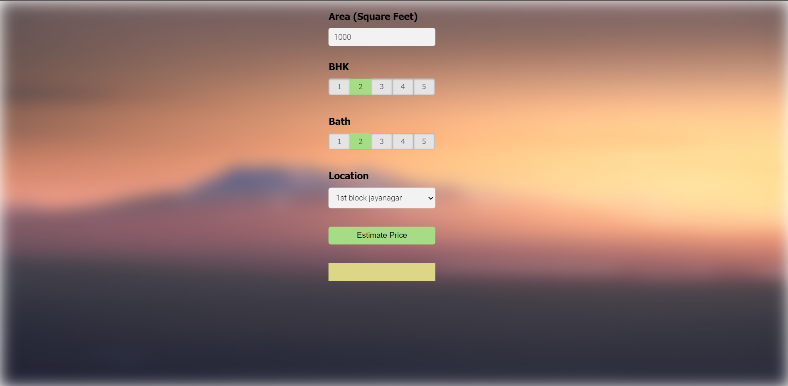

# Introduction -
In this data science project I walked through the process of building a real estate price prediction website. I first built a model using sklearn and linear regression using banglore home prices dataset from kaggle.com. Second step was to create a python flask server that uses the saved model to serve http requests. Third component was the website built using html, css and javascript that allows user to enter home square ft area, bedrooms, etc and it calls the python flask server to retrieve the predicted price. During model building I covered many data science concepts such as data load and cleaning, outlier detection and removal, feature engineering, gridsearchcv for hyperparameter tunning, k fold cross validation, etc. I enjoyed creating this project and I hope you like it😊

# Tools used to create the project-
1. Python
2. Numpy and pandas for data cleaning
3. Matplotlib for data visualization
4. Sklearn for model building
5. Jupyter Notebook in Visual Studio Code as IDE
6. Python flask server for http server
7. HTML/CSS/Javascript for UI

# Deploy this app to cloud (AWS EC2)-

1. Create EC2 instance using amazon console and in secutity group allow HTTP/HTTPS incoming traffic.
2. Now connect to your instance using PuTTY windows application.
3. Become the root user to avoid permission errors with the command-
'''
sudo su
'''
4. 

